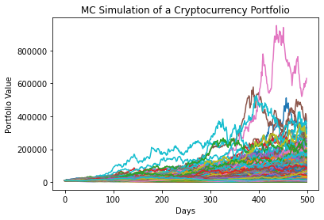
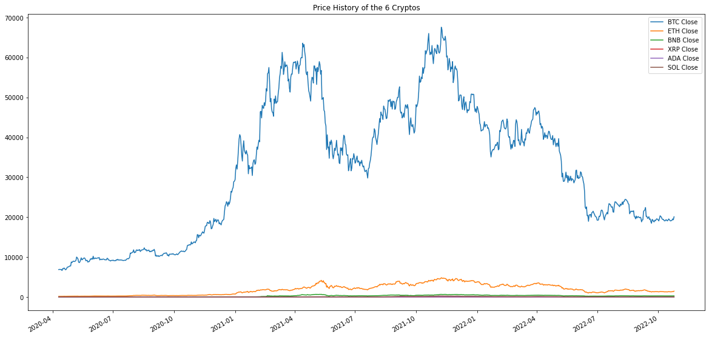
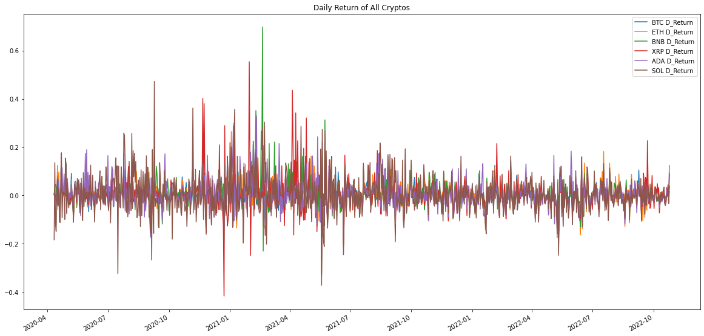
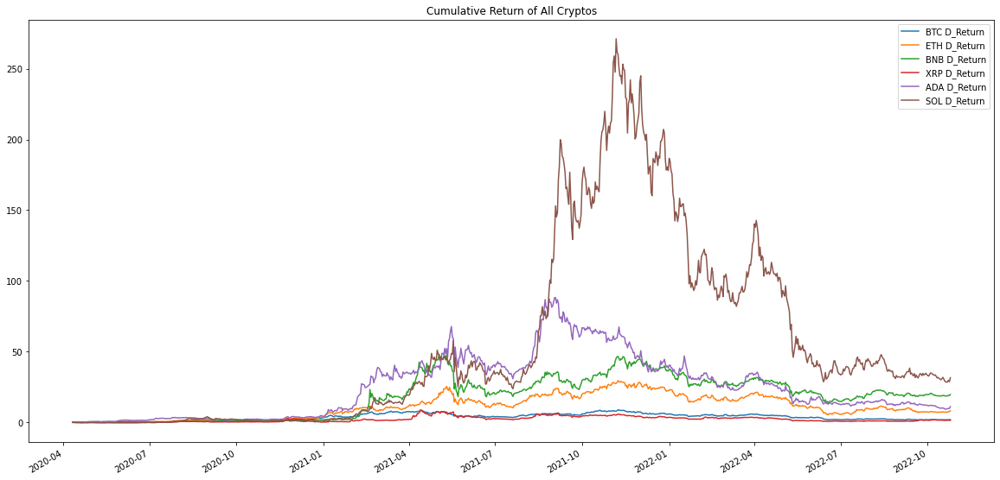
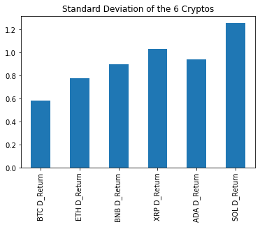
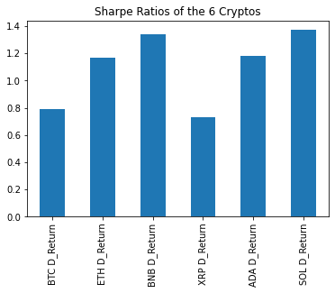
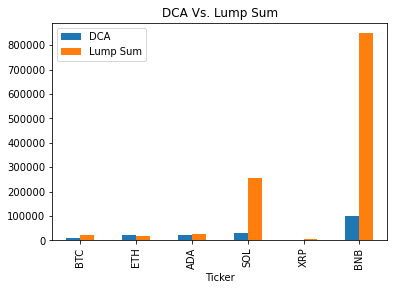

# Crypto_Master


*Image Source: https://www.forbes.com/fintech/2021/#9ba2c8731a63*

> FinTech Project 1

### Group Members

Flora Zhao, Navpreet Nat and Sreeni Patnaik

## Instructions on How to Read Through the Work

**1.** **Please begin with the jupyter notebook file titled "crypto master" which contains the retrospective analysis which has been conducted using historical data**

**2.** **Then, please access the jupyter notebook file titled "MonteCarlo_Interactive" which is an interactive Monte Carlo Simulator using pandas data-reader**

**3.** **The presentation may be found under the filename "Presentation.pptm"**

**4.** **Finally, we wanted to incorporate the Python 'Panels' library into our code however were unable to do so due to time contraints, and so we have instead included the headway we've made so far. While it is not a comprehensive analysis, it does display the functionality of the Panels library and may be found as the jupyter notebook file titled "Crypto_Dashboard"**

*All jupyter notebook files may be found in the subfolder titled "codes"*

## Introduction

For our first project, we showcase what we have learnt in Python so far by addressing the conundrum of determining the ideal cryptocurrency investment strategy. The decentralised world has proved to be a domain of extreme growth, great opportunity and seemingly unlimited potential, while simultaneously presenting itself as a risky, highly volatile, unpredictable and underregulated landscape that can be dominated and swayed easily by invested interests.

We set out to find clarity in a murky cryptoverse by analysing past movements, predicting future trends, and determining for ourselves whether safer and more reliable investment strategies are possible in these turbulent waters.

### Motivation

Cryptocurrency holds great potential for future economies, and despite its high volatility and fluctuating retail confidence, it certainly presents opportunities for the invention of tools that reassure investors by providing clearer market predictions and stability. We were eager to see whether we could set about creating such tools, and investigating the degree of commitment and labour required for their inception. Essentially, whether it was possible to make any meaningful predictions given the knowledge we have accumulated so far.

### Interests

* **Money and Financial Markets**

* **Secure investments for long-term planning**

* **Opportunities for financial growth**

### Questions

* **Is it possible to narrow in on the ideal cryptocurrency portfolio?**

* **Will Monte Carlo Simulations be able to provide realistic future portfolio predictions?**

* **Is Dollar-Cost Averaging an effective strategy for investing in crypto vs an initial Lump Sum?**

### Core Focus

1. **Predict how cryptocurrency portfolios evolve over time by analyzing their history**

2. **Discover the ideal cryptocurrency portfolio that will generate the greatest future returns**

3. **Evaluate the effectiveness of Dollar-Cost Averaging vs an Initial Lump Sum as a crypto investment strategy**

## Conclusions / Results

### The Ideal Cryptocurrency Portfolio

We decided that, at least at the level of the portfolios' composition, it would be best to select coins that have a large market cap as this would ensure that volatility is less than other less 'stable' coins, and would thus be the safer option.

The coins that we arrived at were;

* ```BTC``` **or Bitcoin**

* ```ETH``` **or Ethereum**

* ```BNB``` **or Binance**

* ```XRP``` **or Ripple**

* ```ADA``` **or Cardano**

* ```SOL``` **or Solana**

### The Monte Carlo Simulation as a tool for Cryptocurrency Forecasting

We found through our testing that while a MCS can be quite an effective tool for forecasting the potential price fluctuations of traditional stocks and equities, this applicability does not necessarily translate over to the cryptoverse. Through application of the interactive program that we developed, we found that the predictions had a variablity that was so vast that no meaningful conclusions could be drawn.

It became clear that due to the close-to exponential nature of cryptocurrency price growth over its entire history, retrospective analyses become severely skewed to expect similar price movements going into the future, and while such activity could arguably be a possibility, it's obvious that far more sophisticated techniques are required to meaningfully predict price movements in this space.



### Dollar-Cost Averaging vs Initial Lump-Sum Investment

We were very surprised to discover that what may seemingly appear to be a worthwhile investment strategy in traditional use cases, i.e. Dollar-Cost Averaging (where you invest into an equity/stock incrementally over time as opposed to all at once), such techniques proved to not be so fruitful in the domain of cryptocurrency investment.

The numbers were crunched, and the determination was made that you are infact much better off investing in crypto all at once with a lump-sum investment rather than incrementally over time. This analysis was done using historical data, and the supposition was such that an investor in the past would have invested in a cryptocurrency in one go, versus investing slowly over time as we cannot at this stage accurately project how such investment would look into the future.

Lump sum was found to trump DCA 80% of the time with the coins that we selected, with only ETH showing that DCA could have been an effective investment strategy. This comparison could have also been more comprehensive if we compared the sharpe ratios against the coins' standard deviations, thus taking risk factors into consideration, however we were unable to cover these in this project due to time contraints.

The plots that were generated during these analyses are as follows:













## API and New Library

#### We used Pandas Data-Reader which is both an API and a new Library

## References

* **1** [Cryptocurrencies from Yahoo Finance](https://finance.yahoo.com/cryptocurrencies)

* **2** [How to use Google Finance](https://support.google.com/docs/answer/3093281)

* **3** [How to Fetch BTC price from Google Finance](https://stackoverflow.com/questions/45081166/get-btc-prices-on-google-sheets-from-google-finance)

* **4** [How to use the Cryptocompare API](https://robotwealth.com/fun-with-the-cryptocompare-api/)

* **5** [Top 10 Python Libraries for Data Science for 2023](https://www.simplilearn.com/top-python-libraries-for-data-science-article#8_pytorch)

* **6** [Details Regarding scikit-learn Machine Learning](https://scikit-learn.org/stable/)

* **7** [A Rundown on Dollar-Cost Averaging](https://www.gemini.com/cryptopedia/dollar-cost-average-crypto-invest)

* **8** [How to get historical Stock and Cryptocurrency price data in Python](https://medium.com/@phanhaihiep/how-to-get-historical-stock-and-cryptocurrencys-price-data-in-python-556e00ff4714)

* **9** [Video Tutorial on Monte Carlo Simulation by Quant Py](https://www.youtube.com/watch?v=6-dhdMDiYWQ)

* **10** [Code that Corresponds to the Video Tutorial](https://quantpy.com.au/python-for-finance/simulated-stock-portolio/)

* **11** [How to pip-install Pandas Data-Reader](https://pandas-datareader.readthedocs.io/en/latest/)

* **12** [How to Calculate a Confidence Interval Using numpy](https://medium.com/swlh/building-confidence-interval-using-pythons-numpy-b96cd6e7f2d4)

* **13** [Tutorial on Pandas Data-Reader](https://thecleverprogrammer.com/2021/03/22/pandas-datareader-using-python-tutorial/)

* **14** [Documentation Regarding Plotting on Matplotlib](https://matplotlib.org/stable/api/_as_gen/matplotlib.pyplot.plot.html)

* **15** [Documentation Regarding numpy.ndarray](https://numpy.org/doc/stable/reference/generated/numpy.ndarray.html)

* **16** [Data Science Libraries](https://www.simplilearn.com/top-python-libraries-for-data-science-article#8_pytorch)

* **17** [Normalize Function to Remove Datetime in Dataframe](https://stackoverflow.com/questions/50845338/remove-time-portion-of-datetime-index-in-pandas)

* **18** [How to Convert a String to an Integer](https://www.geeksforgeeks.org/how-to-take-integer-input-in-python/)

---

*Presentation Image References*

* **1** [BTC Coin](https://www.barrons.com/articles/things-to-know-today-51666952850)

* **2** [ETH Coin](https://www.dmarge.com/ethereum-price-prediction-aud)

* **3** [BNB Coin](https://play.google.com/store/apps/details?id=com.binance.dev&hl=en_AU&gl=US)

* **4** [XRP Coin](https://cryptomode.com/3-reasons-to-use-the-xrp-toolkit-when-interacting-with-the-xrp-ledger/)

* **5** [ADA Coin](https://www.newsbtc.com/analysis/ada/why-cardano-ada-may-breakout-in-a-bull-run-to-1/)

* **6** [SOL Coin](https://coinmarketcap.com/currencies/solana/)

* **7** [Mountain](https://i.pinimg.com/originals/1d/3f/43/1d3f4336e6d4d0b3bf9b1d42948db42c.jpg)

---

*November 7th 2022*

---